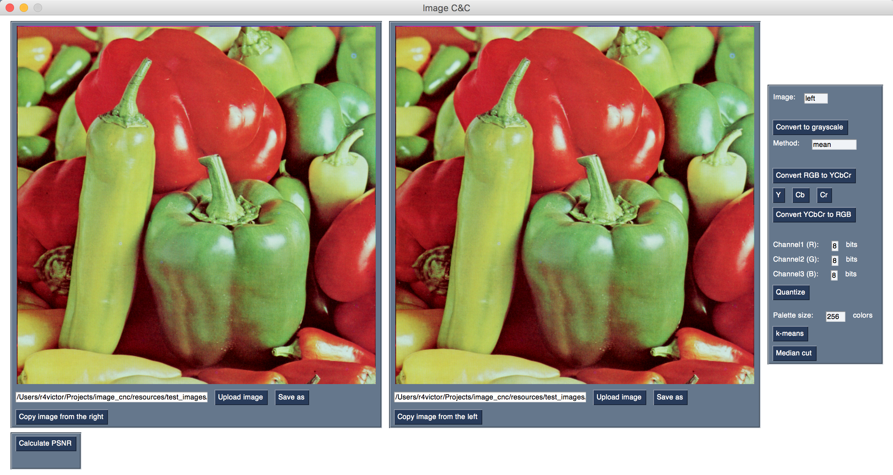

# Image C&C tool

Image C&C (stands for Compress and Compare) is a GUI tool that allows to upload images, modify them and compare the effects of modifications visually and numerically.

Here's how it looks at the moment:



## Requirements

* Python >= 3.8
* `NumPy`
* `Pillow`
* `PySimpleGUI`
* `pytest` (optional, to run tests)

## Installation

1. Clone the repo:

```text
$ git clone https://github.com/r4victor/image_cnc && cd image_cnc
```

2. Install requirements:
```text
$ pip install -r requirements.txt 
```

That's it. Now you can run a program:
```text
$ python image_cnc
```

## Running tests

1. Install `pytest`:
```text
$ pip install pytest
```

2. Run tests:
```text
$ python -m pytest tests
```
